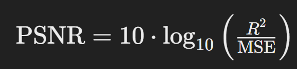
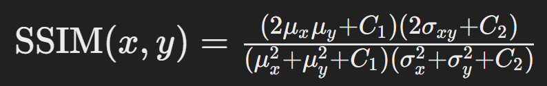

## Introduction

In image processing and steganography, comparing the quality of images is crucial. **Peak Signal-to-Noise Ratio (PSNR)** and **Structural Similarity Index (SSIM)** are two common metrics used to assess how similar a stego image (an image with hidden data) is to the original image. This blog will guide you through understanding these metrics, how they work, and how to use them to compare images effectively.

---

## What is PSNR?

**PSNR (Peak Signal-to-Noise Ratio)** is a metric used to measure the quality of reconstruction of lossy compression codecs. It is commonly used to evaluate the fidelity of image and video compression algorithms. PSNR is calculated based on the Mean Squared Error (MSE) between the original image and the distorted or compressed image.

### Formula for PSNR

The PSNR value is calculated using the following formula:



Where:

- _R_ is the maximum possible pixel value of the image (255 for 8-bit images).
- MSE (Mean Squared Error) is the average of the squared differences between the original and distorted images' pixel values.

### Calculation Steps

1. **Compute MSE**, calculate the Mean Squared Error between the original image and the distorted image.

.png>)

Where _I_(_i_,_j_) is the pixel value of the original image and _K_(_i_,_j_) is the pixel value of the distorted image.

2. **Apply the PSNR Formula**, use the PSNR formula to get the PSNR value in decibels (dB).

### Interpretation

- **Higher PSNR** values indicate better image quality, with minimal distortion.
- **Typical Values**, PSNR values between 30 to 50 dB are common in image compression, where higher values denote better quality.

---

## What is SSIM?

SSIM (Structural Similarity Index) is a metric used to measure the perceived quality of images. Unlike PSNR, which is purely mathematical, SSIM considers changes in structural information, luminance, and contrast. It is designed to align more closely with human visual perception.

### Formula for SSIM

The SSIM index is computed using the following formula:



Where:

.png>)

### Calculation Steps

1. **Compute Mean and Variance**, calculate the mean and variance for both images.
2. **Compute Covariance**, calculate the covariance between the two images.
3. **Apply the SSIM Formula**, use the SSIM formula to get the SSIM value, which ranges from -1 to 1.

### Interpretation

1. **SSIM Value**, ranges from -1 to 1, where 1 indicates a perfect match between the images.
2. **Higher SSIM** values indicate better structural similarity between the original and distorted images.

---

## Comparing Original and Stego Images

When comparing an original image with a stego image (an image containing hidden data), PSNR and SSIM can provide insights into the impact of data embedding on image quality.

### Using PSNR

- Higher PSNR in the stego image compared to the original indicates that the embedding process has caused minimal distortion.
- Lower PSNR may suggest visible quality degradation.

### Using SSIM

- Higher SSIM values in the stego image indicate that the image’s structural and perceptual quality has been maintained.
- Lower SSIM values indicate significant changes or degradation in image structure.

---

## Example: PSNR and SSIM Calculation

Suppose we have the following images:

- **Original Image**: `original.png`
- **Stego Image**: `stego.png`

You can use Python libraries like OpenCV and scikit-image to compute PSNR and SSIM:

```py title="main.py"
import cv2
from skimage.metrics import structural_similarity as ssim
import numpy as np

# Load images
original = cv2.imread('original.png', cv2.IMREAD_GRAYSCALE)
stego = cv2.imread('stego.png', cv2.IMREAD_GRAYSCALE)

# Calculate MSE
mse = np.mean((original - stego) ** 2)

# PSNR Calculation
max_pixel = 255.0
psnr = 20 * np.log10(max_pixel / np.sqrt(mse))

# SSIM Calculation
ssim_index, _ = ssim(original, stego, full=True)

print(f"PSNR: {psnr} dB")
print(f"SSIM: {ssim_index}")
```

### Output

- **PSNR**: Indicates the peak signal-to-noise ratio between the original and stego image.
- **SSIM**: Reflects the structural similarity between the original and stego image.

---

## Conclusion

PSNR and SSIM are essential tools for evaluating the quality of images, especially in fields like steganography where image fidelity is crucial. While PSNR provides a quantitative measure of distortion, SSIM offers a qualitative assessment of perceived image quality. By using both metrics, you can get a comprehensive view of how data embedding affects image quality.

By understanding and applying PSNR and SSIM, you can better assess and improve the quality of images in your projects.

> **Happy learning!**
